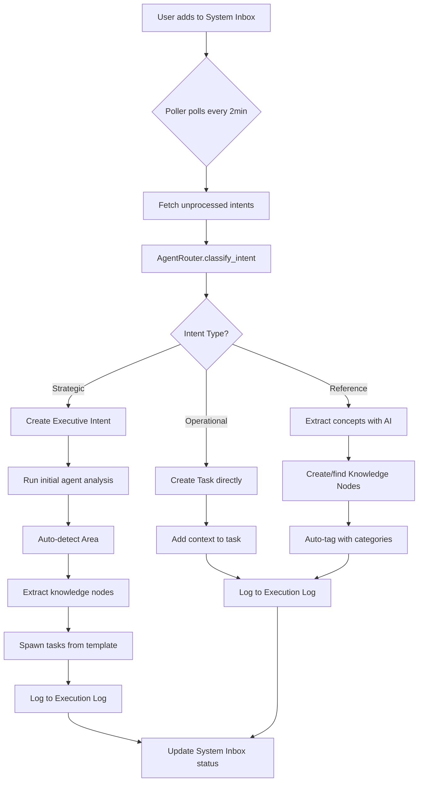
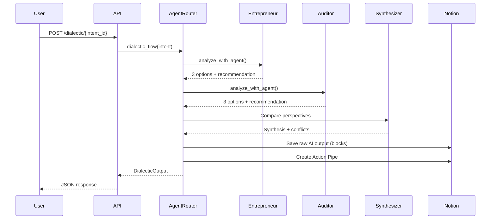
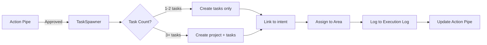
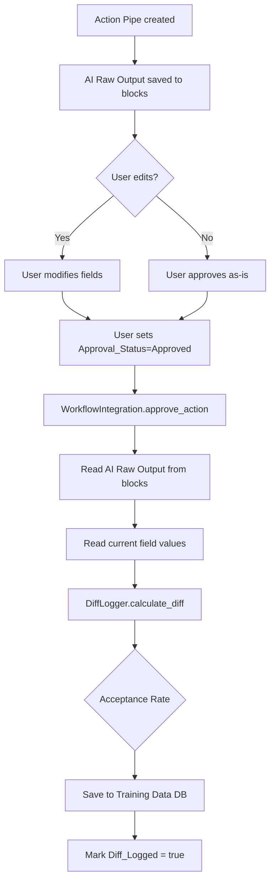

# Executive Mind Matrix - System Architecture

Deep technical dive into the system architecture, workflows, and implementation details.

---

## Table of Contents

1. [System Overview](#system-overview)
2. [Database Schema](#database-schema)
3. [Agent Architecture](#agent-architecture)
4. [Workflow Diagrams](#workflow-diagrams)
5. [API Endpoints](#api-endpoints)
6. [Integration Points](#integration-points)
7. [Data Models](#data-models)
8. [Background Jobs](#background-jobs)
9. [Security Architecture](#security-architecture)
10. [Performance & Scaling](#performance--scaling)

---

## System Overview

### High-Level Architecture

```
┌──────────────────────────────────────────────────────────────┐
│                    FastAPI Application                        │
│                    (Railway Deployment)                       │
│                                                                │
│  ┌────────────────────────────────────────────────────────┐   │
│  │              Application Lifespan                      │   │
│  │  - Startup: Initialize NotionPoller                    │   │
│  │  - Background: Run polling loop (every 2 min)          │   │
│  │  - Shutdown: Graceful stop of async tasks              │   │
│  └────────────────────────────────────────────────────────┘   │
│                                                                │
│  ┌──────────────┐  ┌───────────────┐  ┌──────────────────┐   │
│  │ REST API     │  │ NotionPoller  │  │  Agent Router    │   │
│  │ (FastAPI)    │  │ (2min cycle)  │  │  (Dialectic AI)  │   │
│  └──────┬───────┘  └───────┬───────┘  └────────┬─────────┘   │
│         │                  │                     │             │
└─────────┼──────────────────┼─────────────────────┼─────────────┘
          │                  │                     │
          ▼                  ▼                     ▼
┌─────────────────────────────────────────────────────────────┐
│              External Services                               │
│  ┌──────────────┐  ┌──────────────┐  ┌──────────────────┐   │
│  │   Notion API │  │ Anthropic AI │  │  (Optional)      │   │
│  │  (Databases) │  │   (Claude)   │  │  Sentry/Slack    │   │
│  └──────────────┘  └──────────────┘  └──────────────────┘   │
└─────────────────────────────────────────────────────────────┘
```

### Core Components

#### 1. NotionPoller (`app/notion_poller.py`)

**Purpose**: Background service that monitors System Inbox for new intents

**Responsibilities**:
- Poll Notion every N seconds (default: 120s)
- Fetch unprocessed intents
- Route to appropriate handler based on classification
- Update status and create links

**Key Methods**:
- `start()`: Async loop that runs continuously
- `poll_cycle()`: Single poll iteration with retry logic
- `process_intent()`: Classify and route single intent
- `_check_approved_actions()`: Sweep for manually approved actions

#### 2. AgentRouter (`app/agent_router.py`)

**Purpose**: AI agent orchestrator implementing adversarial dialectic

**Responsibilities**:
- Classify intents (Strategic/Operational/Reference)
- Route to specific agent persona (Entrepreneur/Quant/Auditor)
- Run dialectic flow (Growth vs. Risk analysis)
- Synthesize competing perspectives

**Key Methods**:
- `classify_intent()`: Determine intent type and assign agent
- `analyze_with_agent()`: Single-agent analysis
- `dialectic_flow()`: Multi-agent adversarial analysis
- `_save_raw_ai_output()`: Preserve original AI recommendations

#### 3. WorkflowIntegration (`app/workflow_integration.py`)

**Purpose**: Orchestrates complete workflows across databases

**Responsibilities**:
- Link intents → actions → tasks → projects
- Add rich context to pages (callouts, checklists)
- Log all actions to Execution Log
- Handle approval workflows

**Key Methods**:
- `process_intent_complete_workflow()`: End-to-end intent processing
- `run_dialectic_and_link()`: Add dialectic results to intent page
- `approve_action()`: Approve action and log settlement diff
- `_log_settlement_diff_from_action()`: Capture training data

#### 4. DiffLogger (`app/diff_logger.py`)

**Purpose**: Captures deltas between AI suggestions and human edits

**Responsibilities**:
- Calculate acceptance rates
- Store training examples
- Generate fine-tuning datasets

**Key Methods**:
- `log_settlement_diff()`: Compare original vs. final plans
- `get_agent_performance_metrics()`: Query agent stats
- `export_for_fine_tuning()`: Generate JSONL for Claude fine-tuning

#### 5. SmartRouter (`app/smart_router.py`)

**Purpose**: Automatic agent assignment based on keywords and metadata

**Rules**:
- Financial keywords → The Quant
- Growth keywords → The Entrepreneur
- Compliance keywords → The Auditor
- High risk + high impact → The Auditor (safety first)

#### 6. TaskSpawner (`app/task_spawner.py`)

**Purpose**: Auto-generate tasks and projects from approved actions

**Responsibilities**:
- Parse task templates
- Create individual tasks in DB_Tasks
- Create projects for multi-task initiatives
- Link everything back to source intent

---

## Database Schema

### Database Relationships

```
System Inbox
     │
     ├─→ Executive Intents ────→ Action Pipes ────→ Tasks ────→ Projects
     │         │                      │                │
     │         ├─→ Agent Registry     │                └─→ Areas
     │         ├─→ Knowledge Nodes    │
     │         └─→ Areas              └─→ Execution Log
     │
     ├─→ Tasks (direct for operational)
     │
     └─→ Knowledge Nodes (direct for reference)
                 │
                 └─→ Training Data (settlement diffs)
```

### Key Relation Patterns

#### Intent → Action → Tasks (Strategic Flow)

```sql
-- Pseudo-SQL for illustration
SELECT
    i.Name as intent_name,
    a.Action_Title,
    t.Name as task_name
FROM Executive_Intents i
JOIN Action_Pipes a ON a.Intent = i.id
JOIN Tasks t ON t.Related_Intents = i.id
WHERE i.Status = 'Approved'
```

#### Bidirectional Linking

Every creation updates BOTH sides of the relation:

```python
# Create task from intent
task = await client.pages.create(
    parent={"database_id": DB_TASKS},
    properties={
        "Name": {"title": [{"text": {"content": task_name}}]},
        "Related Intents": {"relation": [{"id": intent_id}]}
    }
)

# Link back to intent
await client.pages.update(
    page_id=intent_id,
    properties={
        "Related_Tasks": {"relation": [{"id": task["id"]}]}
    }
)
```

### Property Validation

**PropertyValidator** (`app/property_validator.py`) prevents duplicate property creation:

```python
# Before adding a property, check if it exists
validator = PropertyValidator(client)
is_valid = await validator.validate_property_addition(
    database_id=DB_EXECUTIVE_INTENTS,
    property_name="New_Field",
    property_type="select"
)
```

Logs all changes to `logs/property_changes.jsonl` for schema governance.

---

## Agent Architecture

### Agent Personas

Each agent is defined by:
1. **System Prompt**: Defines focus, methodology, and personality
2. **Structured Output**: Returns `AgentAnalysis` with 3 scenario options
3. **Focus Areas**: Domain expertise (Growth, Risk, Compliance, Finance)

#### The Entrepreneur (Growth Agent)

**Focus**:
- Revenue generation
- Audience reach
- Scalability
- Speed to market

**Analysis Framework**:
- Revenue potential (direct + indirect)
- Scalability (can this 10x?)
- Competitive moats
- Customer acquisition efficiency (CAC/LTV)

**Output Structure**:
```json
{
  "scenario_options": [
    {"option": "A", "description": "...", "pros": [], "cons": [], "risk": 3, "impact": 8},
    {"option": "B", "description": "...", "pros": [], "cons": [], "risk": 2, "impact": 7},
    {"option": "C", "description": "...", "pros": [], "cons": [], "risk": 4, "impact": 9}
  ],
  "recommended_option": "A",
  "recommendation_rationale": "...",
  "risk_assessment": "...",
  "required_resources": {"time": "...", "money": "...", "tools": [], "people": []},
  "task_generation_template": ["Task 1", "Task 2", "Task 3"]
}
```

#### The Quant (Finance Agent)

**Focus**:
- Risk-adjusted returns
- Quantitative analysis
- Probabilistic thinking
- Portfolio optimization

**Analysis Framework**:
- Expected Value (EV = P × Outcome)
- Sharpe ratio (return per unit of risk)
- Downside protection (max loss scenarios)
- Kelly Criterion (position sizing)

**Terminology**:
- Alpha: Returns above benchmark
- Beta: Correlation with market
- Drawdown: Peak-to-trough decline
- Volatility: Standard deviation

#### The Auditor (Risk Agent)

**Focus**:
- Governance and compliance
- Ethical alignment
- Mission integrity
- Long-term reputation

**Analysis Framework**:
- Mission alignment check
- Ethical considerations
- Legal/regulatory compliance
- Reversibility assessment
- Dependency risk analysis

**Automatic REJECT signals**:
- Violates core values
- Existential risk (financial/legal/reputational)
- Requires unethical behavior
- Creates non-reversible dependencies

### Dialectic Flow Architecture

```
┌─────────────────────────────────────────────────────────────┐
│              Dialectic Flow (3-Phase Analysis)              │
└─────────────────────────────────────────────────────────────┘

Phase 1: Growth Perspective
┌────────────────────────────────────────┐
│ Input: Intent title + description      │
│ Agent: The Entrepreneur                │
│ Output: 3 options + recommendation     │
│ Time: ~20 seconds                      │
└────────────────┬───────────────────────┘
                 │
                 ▼
Phase 2: Risk Perspective
┌────────────────────────────────────────┐
│ Input: Same intent                     │
│ Agent: The Auditor                     │
│ Output: 3 options + recommendation     │
│ Time: ~20 seconds                      │
└────────────────┬───────────────────────┘
                 │
                 ▼
Phase 3: Synthesis
┌────────────────────────────────────────┐
│ Input: Both agent outputs              │
│ Meta-Agent: Synthesizer                │
│ Output:                                │
│  - Synthesis (balanced view)           │
│  - Recommended path (hybrid option)    │
│  - Conflict points (disagreements)     │
│ Time: ~15 seconds                      │
└────────────────────────────────────────┘
                 │
                 ▼
         DialecticOutput
         (saved to intent page)
```

---

## Workflow Diagrams

### Intent Processing Flow (Strategic)



### Dialectic Flow (Detail)



### Task Spawning Flow



### Training Data Capture Flow



---

## API Endpoints

### Core Endpoints

#### Health & Status

```http
GET /
GET /health
```

Response:
```json
{
  "status": "healthy",
  "poller_active": true,
  "polling_interval": 120,
  "databases_configured": { ... }
}
```

#### Manual Triggers

```http
POST /trigger-poll
```

Manually trigger a poll cycle (useful for testing).

```http
POST /analyze-intent/{intent_id}?agent=The%20Entrepreneur
```

Run analysis for specific intent with specific agent.

```http
POST /dialectic/{intent_id}
```

Run full dialectic flow (Growth + Risk + Synthesis).

#### Workflow Endpoints

```http
POST /intent/{intent_id}/create-action
Content-Type: application/json

{
  "action_title": "Implement Decision",
  "action_description": "Execute Option A"
}
```

Create Action Pipe from intent.

```http
POST /action/{action_id}/approve
```

Approve action and log settlement diff.

```http
POST /action/{action_id}/spawn-tasks
```

Generate tasks and project from approved action.

#### Training & Analytics

```http
GET /analytics/agents/summary?time_range=30d
```

Performance summary for all agents.

```http
GET /analytics/agent/{agent_name}/improvements
```

Identify prompt improvement opportunities.

```http
POST /analytics/export/fine-tuning?min_acceptance_rate=0.7
```

Export training data as JSONL for Claude fine-tuning.

#### Smart Router

```http
POST /intent/{intent_id}/assign-agent
```

Auto-assign best agent based on keywords and metadata.

```http
GET /smart-router/explain?intent_title=...&intent_description=...
```

Preview agent assignment without modifying anything.

---

## Integration Points

### Notion API Integration

**Client**: `notion_client.AsyncClient`

**Key Operations**:

```python
# Query database
response = await client.databases.query(
    database_id=DB_ID,
    filter={"property": "Status", "select": {"equals": "Unprocessed"}},
    sorts=[{"property": "Created", "direction": "ascending"}]
)

# Create page
page = await client.pages.create(
    parent={"database_id": DB_ID},
    properties={...}
)

# Update page
await client.pages.update(
    page_id=PAGE_ID,
    properties={...}
)

# Add blocks (for rich content)
await client.blocks.children.append(
    block_id=PAGE_ID,
    children=[
        {"type": "callout", "callout": {...}},
        {"type": "heading_2", "heading_2": {...}}
    ]
)
```

**Rate Limits**:
- 3 requests per second average
- Bursts up to 10 req/sec for 15 seconds
- Handled by `tenacity` retry decorator

### Anthropic API Integration

**Client**: `anthropic.AsyncAnthropic`

**Key Operations**:

```python
# Single message
response = await client.messages.create(
    model="claude-3-haiku-20240307",
    max_tokens=4096,
    system="You are The Entrepreneur...",
    messages=[{"role": "user", "content": prompt}]
)

# Extract JSON response
result_text = response.content[0].text
data = json.loads(result_text)
```

**Models**:
- `claude-3-haiku-20240307`: Fast, cheap ($0.25/MTok input, $1.25/MTok output)
- `claude-3-5-sonnet-20241022`: Better quality, 10x cost ($3/MTok input, $15/MTok output)

**Cost Optimization**:
- Use Haiku for classification and single-agent analysis
- Use Sonnet for complex dialectic synthesis
- Cache system prompts when possible

---

## Data Models

### Pydantic Models (`app/models.py`)

#### AgentAnalysis

```python
class AgentAnalysis(BaseModel):
    scenario_options: List[ScenarioOption]
    recommended_option: str
    recommendation_rationale: str
    risk_assessment: str
    required_resources: Dict[str, Any]
    task_generation_template: List[str]
```

#### DialecticOutput

```python
class DialecticOutput(BaseModel):
    intent_id: str
    growth_perspective: Optional[AgentAnalysis]
    risk_perspective: Optional[AgentAnalysis]
    synthesis: str
    recommended_path: str
    conflict_points: List[str]
```

#### SettlementDiff

```python
class SettlementDiff(BaseModel):
    intent_id: str
    timestamp: datetime
    original_plan: Dict[str, Any]
    final_plan: Dict[str, Any]
    diff_summary: Dict[str, Any]
    user_modifications: List[str]
    acceptance_rate: float
```

### Enums

```python
class AgentPersona(str, Enum):
    ENTREPRENEUR = "The Entrepreneur"
    QUANT = "The Quant"
    AUDITOR = "The Auditor"

class RiskLevel(str, Enum):
    LOW = "Low"
    MEDIUM = "Medium"
    HIGH = "High"

class IntentStatus(str, Enum):
    PENDING = "Pending"
    PROCESSING = "Processing"
    ASSIGNED = "Assigned"
    IN_ANALYSIS = "In_Analysis"
    APPROVED = "Approved"
    EXECUTED = "Executed"
```

---

## Background Jobs

### Poller Service

**Implementation**: Async background task started in FastAPI lifespan

```python
@asynccontextmanager
async def lifespan(app: FastAPI):
    # Startup
    poller = NotionPoller()
    poller_task = asyncio.create_task(poller.start())

    yield

    # Shutdown
    poller.stop()
    poller_task.cancel()
    await poller_task
```

**Polling Loop**:

```python
async def start(self):
    self.is_running = True
    while self.is_running:
        try:
            await self.poll_cycle()
        except Exception as e:
            logger.error(f"Polling cycle error: {e}")

        await asyncio.sleep(self.polling_interval)
```

**Retry Logic**:

```python
@retry(
    stop=stop_after_attempt(3),
    wait=wait_exponential(multiplier=1, min=2, max=10)
)
async def poll_cycle(self):
    # Fetch and process intents
    ...
```

### Settlement Diff Poller

**Purpose**: Automatically detect approvals made directly in Notion (not via API)

```python
async def _check_approved_actions(self):
    # Query for: Approval_Status = "Approved" AND Diff_Logged = False
    response = await client.databases.query(
        database_id=DB_ACTION_PIPES,
        filter={
            "and": [
                {"property": "Approval_Status", "select": {"equals": "Approved"}},
                {"property": "Diff_Logged", "checkbox": {"equals": False}}
            ]
        }
    )

    for action in response["results"]:
        await workflow._log_settlement_diff_from_action(action["id"])
```

Runs every poll cycle (2 minutes).

---

## Security Architecture

### CORS Configuration

```python
from fastapi.middleware.cors import CORSMiddleware

app.add_middleware(
    CORSMiddleware,
    allow_origins=settings.allowed_origins,
    allow_credentials=True,
    allow_methods=["GET", "POST"],
    allow_headers=["*"]
)
```

### Rate Limiting

```python
from slowapi import Limiter
from slowapi.util import get_remote_address

limiter = Limiter(key_func=get_remote_address)

@app.post("/trigger-poll")
@limiter.limit(f"{settings.rate_limit_per_minute}/minute")
async def trigger_poll():
    ...
```

### API Key Authentication (Optional)

```python
from fastapi import Header, HTTPException

async def verify_api_key(x_api_key: str = Header(...)):
    if settings.api_key and x_api_key != settings.api_key:
        raise HTTPException(status_code=403, detail="Invalid API key")
```

### Secrets Management

- Environment variables via Railway/Docker
- No secrets in code or logs
- API keys rotated every 90 days

---

## Performance & Scaling

### Current Performance

**Metrics** (Claude Haiku on Railway Starter):
- Intent classification: ~2-3 seconds
- Single-agent analysis: ~15-20 seconds
- Dialectic flow: ~45-60 seconds
- Task spawning: ~3-5 seconds

**Bottlenecks**:
1. Anthropic API latency (sequential calls)
2. Notion API rate limits (3 req/sec)
3. Railway 512MB RAM limit

### Optimization Strategies

#### 1. Parallel API Calls

```python
# Instead of sequential
growth = await router.analyze_with_agent(AgentPersona.ENTREPRENEUR, ...)
risk = await router.analyze_with_agent(AgentPersona.AUDITOR, ...)

# Do parallel
growth, risk = await asyncio.gather(
    router.analyze_with_agent(AgentPersona.ENTREPRENEUR, ...),
    router.analyze_with_agent(AgentPersona.AUDITOR, ...)
)
```

Reduces dialectic time from 45s to 25s.

#### 2. Caching

```python
from functools import lru_cache

@lru_cache(maxsize=100)
async def get_agent_by_name(agent_name: str):
    # Cache agent lookups
    ...
```

#### 3. Batch Processing

```python
# Process multiple intents in parallel
intents = await fetch_pending_intents()
tasks = [process_intent(intent) for intent in intents]
results = await asyncio.gather(*tasks, return_exceptions=True)
```

### Scaling Paths

#### Vertical Scaling (Railway)

| RAM | Max Intents/Day | Cost |
|-----|----------------|------|
| 512MB | 20-30 | $5/mo |
| 2GB | 100-150 | $20/mo |
| 8GB | 500+ | $80/mo |

#### Horizontal Scaling (Not implemented)

- Split poller and API into separate services
- Use message queue (Redis/RabbitMQ) for intent processing
- Deploy multiple workers for parallel processing

#### Database Optimization

- Notion has no query optimization options
- Consider caching frequent queries in Redis
- Denormalize data for read-heavy operations

---

## Extending the System

### Adding Custom Agents

1. **Define system prompt** in `app/agent_router.py`:

```python
self.agent_prompts[AgentPersona.CUSTOM] = """
You are The Custom Agent, specialized in...

FOCUS: ...
METHODOLOGY: ...
OUTPUT: 3 options with pros/cons
"""
```

2. **Add to enum** in `app/models.py`:

```python
class AgentPersona(str, Enum):
    ENTREPRENEUR = "The Entrepreneur"
    QUANT = "The Quant"
    AUDITOR = "The Auditor"
    CUSTOM = "The Custom Agent"
```

3. **Register in Notion** Agent Registry database

4. **Update Smart Router** keywords in `app/smart_router.py`

### Adding Custom Workflows

Example: Auto-send approved actions to Slack

```python
# In app/workflow_integration.py

async def approve_action(self, action_id: str):
    # Existing logic
    await super().approve_action(action_id)

    # Custom: Send to Slack
    if settings.slack_webhook_url:
        await self._send_to_slack(action_id)

async def _send_to_slack(self, action_id: str):
    import httpx
    action = await self.client.pages.retrieve(page_id=action_id)
    title = action["properties"]["Action_Title"]["title"][0]["text"]["content"]

    await httpx.post(
        settings.slack_webhook_url,
        json={"text": f"✅ Action approved: {title}"}
    )
```

### Adding Custom Databases

1. Create database in Notion with required properties
2. Share with integration
3. Add database ID to `.env`:
   ```
   NOTION_DB_CUSTOM=your_database_id
   ```
4. Add to `config/settings.py`:
   ```python
   notion_db_custom: str
   ```
5. Use in code:
   ```python
   await client.pages.create(
       parent={"database_id": settings.notion_db_custom},
       properties={...}
   )
   ```

---

## Monitoring & Observability

### Logging

**Loguru** configuration:

```python
logger.add(
    "logs/app.log",
    rotation="1 day",
    retention="7 days",
    level="DEBUG",
    format="{time} {level} {message}"
)
```

**Log Levels**:
- DEBUG: Detailed workflow steps
- INFO: Intent processing, API calls
- WARNING: Recoverable errors, fallbacks
- ERROR: Critical failures

### Metrics (Optional: Prometheus)

```python
from prometheus_client import Counter, Histogram

intents_processed = Counter('intents_processed_total', 'Total intents processed')
api_latency = Histogram('api_latency_seconds', 'API call latency')

@app.post("/trigger-poll")
async def trigger_poll():
    with api_latency.time():
        result = await poller.poll_cycle()
        intents_processed.inc()
    return result
```

### Error Tracking (Optional: Sentry)

```python
import sentry_sdk

sentry_sdk.init(
    dsn=settings.sentry_dsn,
    traces_sample_rate=settings.sentry_traces_sample_rate
)
```

---

## Testing Architecture

### Unit Tests

```python
# tests/test_agent_router.py

@pytest.mark.asyncio
async def test_classify_strategic_intent():
    router = AgentRouter()
    result = await router.classify_intent(
        "Should I hire a senior engineer or outsource?"
    )
    assert result["type"] == "strategic"
    assert result["agent"] in ["The Entrepreneur", "The Quant"]
```

### Integration Tests

```python
# tests/test_integration.py

@pytest.mark.asyncio
async def test_end_to_end_intent_flow():
    # Create test intent in Notion
    # Trigger poll
    # Verify intent was processed
    # Verify Executive Intent was created
    # Verify agent analysis was run
```

### Test Coverage

Run with pytest:
```bash
pytest --cov=app tests/
```

Target coverage: >80%

---

## Deployment Architecture

### Railway Configuration

**Runtime**:
- Python 3.11+
- Auto-detected from `runtime.txt`

**Build**:
- Detects `Dockerfile` (if present) or `requirements.txt`
- Runs `pip install -r requirements.txt`

**Start Command**:
```bash
uvicorn main:app --host 0.0.0.0 --port $PORT
```

**Health Checks**:
```yaml
healthcheck:
  path: /health
  interval: 30s
  timeout: 10s
```

### Docker Configuration (Alternative)

```dockerfile
FROM python:3.11-slim

WORKDIR /app

COPY requirements.txt .
RUN pip install --no-cache-dir -r requirements.txt

COPY . .

CMD ["uvicorn", "main:app", "--host", "0.0.0.0", "--port", "8000"]
```

---

## Future Enhancements

### P3 Features (Planned)

- [ ] **Multi-user support**: Role-based access control
- [ ] **Slack/Discord notifications**: Real-time updates
- [ ] **Custom agent builder**: UI for creating personas
- [ ] **Workflow templates**: Pre-built decision frameworks
- [ ] **Analytics dashboard**: Grafana + Prometheus
- [ ] **Fine-tuned models**: Custom Claude models per agent
- [ ] **Approval workflows**: Multi-stakeholder sign-off
- [ ] **Mobile app**: Native iOS/Android clients

---

**This architecture is designed for extensibility, reliability, and learning. Every component feeds back into the training loop to continuously improve decision quality.**
